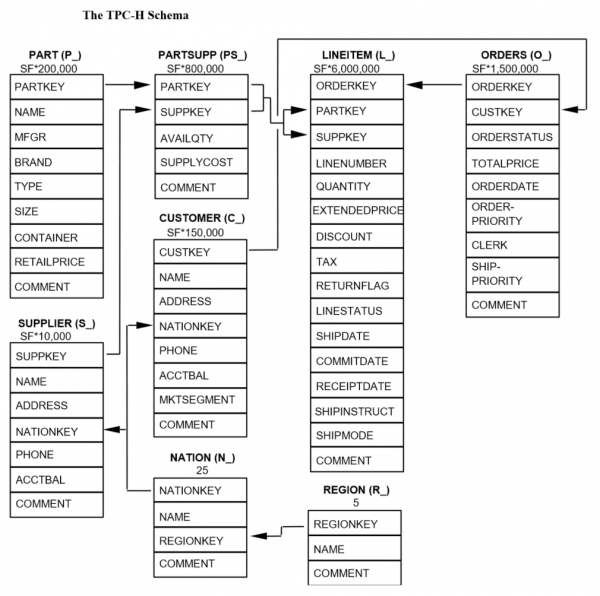

# Creating a Simple Batch Pipeline with Spark

In this article, we will build a simple batch processing pipeline using Apache
Spark in Databricks. Here, we use the TPC-H workload for demonstration.

:::info
The full Spark SQL for this article is available [here](./spark.sql).
:::

The [TPC-H specification](https://www.tpc.org/tpch/) describes itself as
follows:

> The TPC-H is a decision support benchmark. It consists of a suite of business
oriented ad-hoc queries and concurrent data modifications. The queries and the
data populating the database have been chosen to have broad industry-wide
relevance. This benchmark illustrates decision support systems that examine
large volumes of data, execute queries with a high degree of complexity, and
give answers to critical business questions.

The raw data, stored in Delta Lake format, is publicly available in a S3 bucket
at `s3://batchtofeldera`. The dataset is sourced from the
[TPC-H Big Dataset](https://github.com/dbtoaster/dbtoaster-experiments-data/tree/master/tpch/big).

## TPC-H Schema



## Table Definitions

### Spark / Databricks

Create a new Databricks notebook and connect it to a cluster. You can either set
up a S3 bucket with Delta Tables or use
[Databricks Sample Datasets](https://docs.databricks.com/aws/en/discover/databricks-datasets#unity-catalog-datasets).
If using Databricks' sample dataset, tables should be avaiable in `samples.tpch`.

To list the tables, run:

```sql
SHOW TABLES IN samples.tpch;
```

**Creating tables from Delta Tables in Spark:**

Before we can create a table from our Delta Tables in S3, we must first setup
a datasource.

- Expand the Databricks Console Sidebar.
- Click on **Data Ingestion** under the **Data Engineering** section.
- Click on **Create table from Amazon S3** under the **Files** section.
- Provide credentials / IAM role to connect to the S3.

Finally, create a new SQL notebook with the following table definitions:

```sql
-- Spark SQL
CREATE TABLE IF NOT EXISTS lineitem LOCATION 's3://batchtofeldera/lineitem';
CREATE TABLE IF NOT EXISTS orders LOCATION 's3://batchtofeldera/orders';
CREATE TABLE IF NOT EXISTS part LOCATION 's3://batchtofeldera/part';
CREATE TABLE IF NOT EXISTS customer LOCATION 's3://batchtofeldera/customer';
CREATE TABLE IF NOT EXISTS supplier LOCATION 's3://batchtofeldera/supplier';
CREATE TABLE IF NOT EXISTS nation LOCATION 's3://batchtofeldera/nation';
CREATE TABLE IF NOT EXISTS region LOCATION 's3://batchtofeldera/region';
CREATE TABLE IF NOT EXISTS partsupp LOCATION 's3://batchtofeldera/partsupp';
```

| Table    | Records |
|----------|---------|
| customer | 15.0k   |
| lineitem | 601k    |
| nation   | 25      |
| orders   | 150k    |
| part     | 20.0k   |
| partsupp | 80.0k   |
| region   | 5       |
| supplier | 1.00k   |


## Queries

#### Databricks Cluster Specification

```
Databricks Runtime Version: 15.4 LTS (includes Apache Spark 3.5.0, Scala 2.12)
Min Workers: 2
Max Workers: 10
Worker Type: m6i.large, 8 GB Memory, 2 Cores
Driver Type: m6i.large, 8 GB Memory, 2 Cores
```

### Q1: Pricing Summary Report

```sql
create view q1
as select
	l_returnflag,
	l_linestatus,
	sum(l_quantity) as sum_qty,
	sum(l_extendedprice) as sum_base_price,
	sum(l_extendedprice * (1 - l_discount)) as sum_disc_price,
	sum(l_extendedprice * (1 - l_discount) * (1 + l_tax)) as sum_charge,
	avg(l_quantity) as avg_qty,
	avg(l_extendedprice) as avg_price,
	avg(l_discount) as avg_disc,
	count(*) as count_order
from
	lineitem
where
	l_shipdate <= date '1998-12-01' - interval '90' day
group by
	l_returnflag,
	l_linestatus
order by
	l_returnflag,
	l_linestatus;
```

Now, running this query:

```sql
select * from q1;
```

Runtime: 23.34s

### Q2: Lowest Cost Supplier

```sql
create view q2
as select
	s_acctbal,
	s_name,
	n_name,
	p_partkey,
	p_mfgr,
	s_address,
	s_phone,
	s_comment
from
	part,
	supplier,
	partsupp,
	nation,
	region
where
	p_partkey = ps_partkey
	and s_suppkey = ps_suppkey
	and p_size = 15
	and p_type like '%BRASS'
	and s_nationkey = n_nationkey
	and n_regionkey = r_regionkey
	and r_name = 'EUROPE'
	and ps_supplycost = (
		select
			min(ps_supplycost)
		from
			partsupp,
			supplier,
			nation,
			region
		where
			p_partkey = ps_partkey
			and s_suppkey = ps_suppkey
			and s_nationkey = n_nationkey
			and n_regionkey = r_regionkey
			and r_name = 'EUROPE'
	)
order by
	s_acctbal desc,
	n_name,
	s_name,
	p_partkey
limit 100;
```

Runtime: 10.84s

### Q3: Transportation Priority

```sql
create view q3
as select
	l_orderkey,
	sum(l_extendedprice * (1 - l_discount)) as revenue,
	o_orderdate,
	o_shippriority
from
	customer,
	orders,
	lineitem
where
	c_mktsegment = 'BUILDING'
	and c_custkey = o_custkey
	and l_orderkey = o_orderkey
	and o_orderdate < date '1995-03-15'
	and l_shipdate > date '1995-03-15'
group by
	l_orderkey,
	o_orderdate,
	o_shippriority
order by
	revenue desc,
	o_orderdate
limit 10;
```

Runtime: 8.51s

### Q4: Order Priority

```sql
create view q4
as select
	o_orderpriority,
	count(*) as order_count
from
	orders
where
	o_orderdate >= date '1993-07-01'
	and o_orderdate < date '1993-07-01' + interval '3' month
	and exists (
		select
			*
		from
			lineitem
		where
			l_orderkey = o_orderkey
			and l_commitdate < l_receiptdate
	)
group by
	o_orderpriority
order by
	o_orderpriority;
```

Runtime: 5.85s

### Q5: Local Supplier Revenue

```sql
create view q5
as select
	n_name,
	sum(l_extendedprice * (1 - l_discount)) as revenue
from
	customer,
	orders,
	lineitem,
	supplier,
	nation,
	region
where
	c_custkey = o_custkey
	and l_orderkey = o_orderkey
	and l_suppkey = s_suppkey
	and c_nationkey = s_nationkey
	and s_nationkey = n_nationkey
	and n_regionkey = r_regionkey
	and r_name = 'ASIA'
	and o_orderdate >= date '1994-01-01'
	and o_orderdate < date '1994-01-01' + interval '1' year
group by
	n_name
order by
	revenue desc;
```

Runtime: 7.99s

### Q6: Forecast Revenue Change

```sql
create view q6
as select
	sum(l_extendedprice * l_discount) as revenue
from
	lineitem
where
	l_shipdate >= date '1994-01-01'
	and l_shipdate < date '1994-01-01' + interval '1' year
	and l_discount between .06 - 0.01 and .06 + 0.01
	and l_quantity < 24;
```

Runtime: 3.99s

### Q7: Batch Shipment

```sql
create view q7
as select
	supp_nation,
	cust_nation,
	l_year,
	sum(volume) as revenue
from
	(
		select
			n1.n_name as supp_nation,
			n2.n_name as cust_nation,
			year(l_shipdate) as l_year,
			l_extendedprice * (1 - l_discount) as volume
		from
			supplier,
			lineitem,
			orders,
			customer,
			nation n1,
			nation n2
		where
			s_suppkey = l_suppkey
			and o_orderkey = l_orderkey
			and c_custkey = o_custkey
			and s_nationkey = n1.n_nationkey
			and c_nationkey = n2.n_nationkey
			and (
				(n1.n_name = 'FRANCE' and n2.n_name = 'GERMANY')
				or (n1.n_name = 'GERMANY' and n2.n_name = 'FRANCE')
			)
			and l_shipdate between date '1995-01-01' and date '1996-12-31'
	) as shipping
group by
	supp_nation,
	cust_nation,
	l_year
order by
	supp_nation,
	cust_nation,
	l_year;
```

Runtime: 6.91s

### Q8: National Market Share

```sql
create view q8
as select
	o_year,
	sum(case
		when nation = 'BRAZIL' then volume
		else 0
	end) / sum(volume) as mkt_share
from
	(
		select
			year(o_orderdate) as o_year,
			l_extendedprice * (1 - l_discount) as volume,
			n2.n_name as nation
		from
			part,
			supplier,
			lineitem,
			orders,
			customer,
			nation n1,
			nation n2,
			region
		where
			p_partkey = l_partkey
			and s_suppkey = l_suppkey
			and l_orderkey = o_orderkey
			and o_custkey = c_custkey
			and c_nationkey = n1.n_nationkey
			and n1.n_regionkey = r_regionkey
			and r_name = 'AMERICA'
			and s_nationkey = n2.n_nationkey
			and o_orderdate between date '1995-01-01' and date '1996-12-31'
			and p_type = 'ECONOMY ANODIZED STEEL'
	) as all_nations
group by
	o_year
order by
	o_year;
```

Runtime: 7.52s

### Q9: Product Type Profit Measurement

```sql
create view q9
as select
	nation,
	o_year,
	sum(amount) as sum_profit
from
	(
		select
			n_name as nation,
			year(o_orderdate) as o_year,
			l_extendedprice * (1 - l_discount) - ps_supplycost * l_quantity as amount
		from
			part,
			supplier,
			lineitem,
			partsupp,
			orders,
			nation
		where
			s_suppkey = l_suppkey
			and ps_suppkey = l_suppkey
			and ps_partkey = l_partkey
			and p_partkey = l_partkey
			and o_orderkey = l_orderkey
			and s_nationkey = n_nationkey
			and p_name like '%green%'
	) as profit
group by
	nation,
	o_year
order by
	nation,
	o_year desc;
```

Runtime: 8.16s

### Q10: Return Report

```sql
create view q10
as select
	c_custkey,
	c_name,
	sum(l_extendedprice * (1 - l_discount)) as revenue,
	c_acctbal,
	n_name,
	c_address,
	c_phone,
	c_comment
from
	customer,
	orders,
	lineitem,
	nation
where
	c_custkey = o_custkey
	and l_orderkey = o_orderkey
	and o_orderdate >= date '1993-10-01'
	and o_orderdate < date '1993-10-01' + interval '3' month
	and l_returnflag = 'R'
	and c_nationkey = n_nationkey
group by
	c_custkey,
	c_name,
	c_acctbal,
	c_phone,
	n_name,
	c_address,
	c_comment
order by
	revenue desc
limit 20;
```

Runtime: 7.97s

## That was fast enough, why bother with Feldera?

The problem is every time the input Delta table is updated, the entire query
must be re-executed, meaning waiting for another 4-24 seconds. As the input
Delta table grows, the runtime will increase accordingly, potentially making
the operational cost disproportionately higher than the value derived from the
data. Recomputing on the entire dataset also means spending a lot of resources.

Feldera, on the other hand, replaces this batch job with an **always-on**,
incremental pipeline that continuously updates their outputs in real-time as
new data arrives. Since Feldera pipelines operate incrementally, when a new
input is received, Feldera only computes on this new data instead of the entire
dataset. This way, the updates are instantaneous, and the operation cost
minimal, creating a **win-win** situation.
