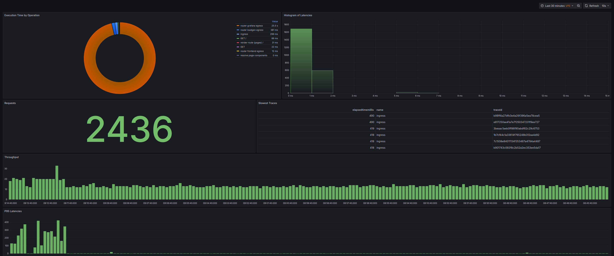
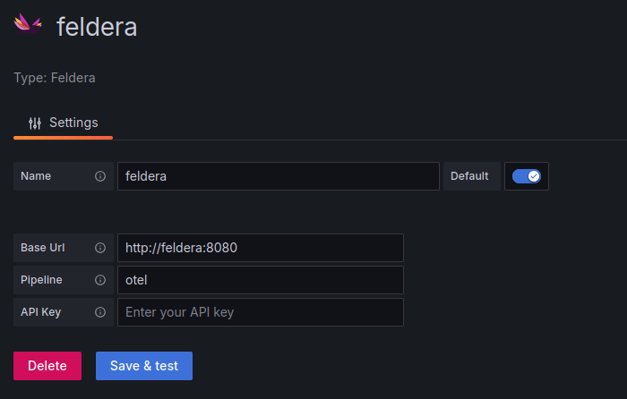

# Grafana Integration

The next step is to integrate with Grafana so that we can query Feldera for these insights.

We will create a Grafana dashboard[^1] like the one shown below:



[^1]: This dashboard takes inspiration from the workshop: [Analyzing and Visualizing OpenTelemetry Traces with SQL - John Pruitt, Timescale](https://www.youtube.com/watch?v=rjJgZ_MNmPQ)

#### Step 1: Install the Feldera Grafana Plugin

Since the Feldera data source plugin is not yet available in the Grafana marketplace, it must be **manually installed** from [GitHub](https://github.com/feldera/grafana-datasource). You can download the latest release and unzip in in the plugins directory of your Grafana server.

This plugin allows Grafana to seamlessly execute ad-hoc queries (see: [Ad-hoc Query docs](https://docs.feldera.com/sql/ad-hoc)) on Feldera pipelines, to treat Feldera just like any other compatible data source.

#### Step 2: Add Feldera as a Data Source in Grafana

Steps to add a new data source:
7. Open the Grafana Dashboard and go to **Connections -> Add New Connection**
8. Search for **Feldera** and select the **Feldera Data Source Plugin**.
9. Click **"Add a new data source"**.

#### Step 3: Configure the Feldera Data Source



##### Required Fields:

| Field         | Value                                                            |
| ------------- | ---------------------------------------------------------------- |
| Base URL      | `http://feldera:8080` _(If running in Docker alongside Grafana)_ |
| Pipeline Name | `otel` _(Your Feldera pipeline name)_                            |
| API Key       | _(If authentication is required, provide the API Key)_           |

Click **"Save & Test"** to verify the connection.

## Creating a Grafana Dashboard

Once Feldera is set up as a data source, you can build a **custom Grafana dashboard** to visualize OpenTelemetry data.

- For all the visualizations we create here, use the **feldera** data source.
- For all **time series visualizations**, it is important to define a **data type transformation** to specify the `TIME` field of the data.
- All of the queries defined below are run by Grafana using the **feldera** data source plugin to query our OTel pipeline.

#### Requests Count

This visualization displays the total number of requests in the selected time range.
Visualization Type: **Stat**


```sql
-- requests count
SELECT
	COUNT(*) as num_traces
FROM
	spans s
WHERE
	s.parentSpanId = '' AND
	s.eventTime BETWEEN $__timeFrom() AND $__timeTo()
```

- Filters only **top-level spans** (i.e., spans without a `parentSpanId`).
- Uses Grafana's **`$__timeFrom()`** and **`$__timeTo()`** macros to dynamically apply the selected time range.

#### Slowest Traces

Identifies the six slowest traces in the given time frame.
Visualization Type: **Table**

```sql
-- slowest traces
SELECT
	s.traceId, s.name, s.elapsedTimeMillis
FROM
	spans s
WHERE
	s.parentSpanId = '' AND
	s.eventTime BETWEEN $__timeFrom() AND $__timeTo()
ORDER BY
	elapsedTimeMillis DESC
LIMIT
	6
```
#### Histogram of Latencies

Provides a latency histogram to analyze response time patterns.
Visualization Type: **Histogram**

```sql
-- histogram of latencies
SELECT
	s.elapsedTimeMillis
FROM
	spans s
WHERE
	s.parentSpanId = '' AND
	s.eventTime BETWEEN $__timeFrom() AND $__timeTo()
ORDER BY
	s.eventTime DESC
```

#### P95 Latencies

Tracks the **95th percentile latency** over time.
Visualization Type: **"Bar chart"**

```sql
-- p95_latency
SELECT
	*
FROM
	p95_latency
WHERE
	time BETWEEN $__timeFrom() AND $__timeTo()
ORDER BY
	time DESC
```

#### Throughput

Measures the **number of requests per 10 second buckets**.
Visualization Type: **"Bar chart"**

```sql
-- throughput
SELECT
	*
FROM
	throughput
WHERE
	time BETWEEN $__timeFrom() AND $__timeTo()
ORDER BY
	time DESC
```

#### Pie chart of Operation Executions Time

Displays **execution time per operation**, showing where time is spent.
Visualization Type: **"Pie chart"**

```sql
-- operation executions time
SELECT
	sum(elapsed) as elapsed,
	name
FROM
	operation_execution_time
GROUP BY
	name
```

## Takeaways

In this example, we used Feldera to analyze OpenTelemetry data and visualize it in Grafana.
We demonstrated how OTel data can be easily modeled in Feldera using `VARIANT` and custom types,
and how aggregations and window functions can be used for powerful analysis.

Additionally, we show how seamlessly, using the Feldera data source plugin, Grafana can query Feldera using
ad-hoc SQL queries to create insightful dashboards.

Feldera also enables users to join traces, metrics, and logs, providing a more comprehensive view of the
system being observed.

Moreover, further optimizations can be applied to this example using constructs like
[LATENESS](https://docs.feldera.com/sql/streaming#lateness-expressions)
and [Storage](https://www.feldera.com/blog/storage-shipped)
to efficiently garbage collect old state, and manage resource usage.


