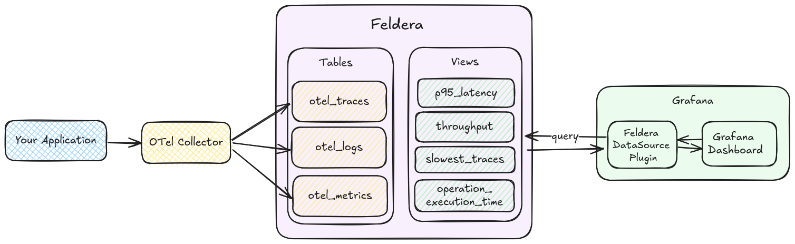

# Use Case: OpenTelemetry

In this article, we demonstrate how easy it is to use Feldera to build a simple, SQL-based observability solution for OpenTelemetry (OTel) data. While this approach is focused on OTel data, it is not limited to it, and the same principles can be applied to other types of data. OpenTelemetry data can be massive and is of [append-only](https://docs.feldera.com/sql/streaming/#append_only-tables) nature, and Feldera's incremental computation capabilities shine through here.

We will go through the following steps:
- Push data to Feldera from OTel Collector
- Write SQL queries to represent and analyze this data
- Make ad-hoc queries from Grafana and create insightful visualizations

An implementation of this use case can be found in: [Feldera OTel Demo](https://github.com/feldera/otel-demo).

## Intended Audience

This guide is designed for the following audiences:

- **Site Reliability Engineers (SREs)**: Those seeking an efficient and cost-effective observability solution.
- **Developers & DevOps Engineers**: Individuals looking for an easy way to analyze and visualize telemetry data using SQL.
- **Data Engineers**: Those in need of a scalable solution for real-time telemetry data analysis.

Feldera isn't a direct replacement for traditional observability tools; rather, it serves as a complementary addition to enhance their capabilities.
