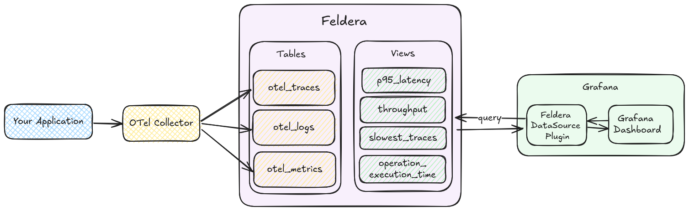

# Use Case: OpenTelemetry

In this article, we demonstrate how to use Feldera to build a simple, SQL-based observability solution for OpenTelemetry (OTel) data. While this approach is focused on OTel data, it is not limited to it, and the same principles can be applied to other types of observability data. OpenTelemetry data is high-bandwidth and [append-only](https://docs.feldera.com/sql/streaming/#append_only-tables), and Feldera's incremental computation engine works very well here.

We build the solution step by step:
- Push data to Feldera from OTel Collector
- Write SQL queries to analyze this data
- Make ad-hoc queries from Grafana to Feldera and create insightful visualizations

The following picture shows a diagram of the data flow:

Complete source code for this use case can be found in the [Feldera OTel Demo](https://github.com/feldera/otel-demo).

## Intended Audience

This guide is designed for the following audiences:

- **Site Reliability Engineers (SREs)**: Those seeking an efficient and cost-effective observability solution.
- **Developers & DevOps Engineers**: Individuals looking for an easy way to analyze and visualize telemetry data.
- **Data Engineers**: Those in need of a scalable solution for real-time telemetry data analysis.

## Contrast to Existing Observability Tools

Feldera offers **greater flexibility and expressiveness** in processing observability data compared to traditional tools.
Feldera supports **arbitrary SQL queries** instead of just a subset of SQL like most tools,
giving users full control over data processing and analysis.
You can define views tailored to your needs and extend functionality with **user-defined functions (UDFs)** for more advanced computations.

Additionally, Feldera makes it seamless to stream processed results to external systems like **Kafka or S3 (Delta Table)**,
enabling easy access, backfilling, and long-term storage.

Most importantly, **Feldera's incremental nature ensures stable resource utilization as data volume grows**,
making it an efficient and scalable solution for handling large-scale telemetry data.

