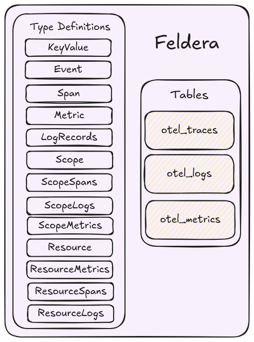
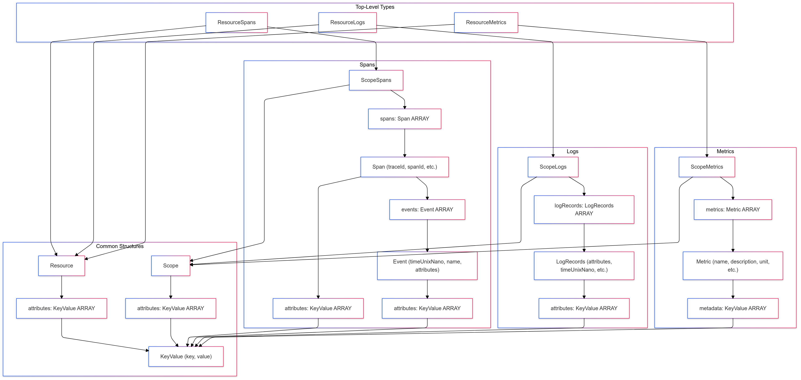

# Representing OTel Data



OpenTelemetry data is typically structured as nested JSON, which we can model as user-defined SQL types (see: [User Defined Types Docs](https://docs.feldera.com/sql/types#user-defined-types)) in Feldera
based on the [OTel Protobuf definitions](https://github.com/open-telemetry/opentelemetry-proto/tree/main/opentelemetry/proto).
While it is possible to represent the entire OTel JSON data as a `VARIANT` type ([VARIANT docs](https://docs.feldera.com/sql/json#the-variant-type)),
user-defined types are more efficient and ergonomic in cases when the JSON schema is known in advance.
Custom types also have a smaller memory footprint and offer better type checking.

Feldera SQL allows us to define these custom types as follows:

```sql
CREATE TYPE KeyValue AS (
    key VARCHAR,
    value VARIANT
);

CREATE TYPE Event AS (
    timeUnixNano CHAR(20),
    name VARCHAR,
    attributes KeyValue ARRAY
);

CREATE TYPE Span AS (
    traceId VARCHAR,
    spanId VARCHAR,
    traceState VARCHAR,
    parentSpanId VARCHAR,
    flags BIGINT,
    name VARCHAR,
    kind INT,
    startTimeUnixNano CHAR(20),
    endTimeUnixNano CHAR(20),
    attributes KeyValue ARRAY,
    events Event ARRAY
);

CREATE TYPE Metric AS (
    name VARCHAR,
    description VARCHAR,
    unit VARCHAR,
    sum VARIANT,
    gauge VARIANT,
    summary VARIANT,
    histogram VARIANT,
    exponentialHistogram VARIANT,
    metadata KeyValue ARRAY
);

CREATE TYPE LogRecords AS (
    attributes KeyValue ARRAY,
    timeUnixNano CHAR(20),
    observedTimeUnixNano CHAR(20),
    severityNumber INT,
    severityText VARCHAR,
    flags INT4,
    traceId VARCHAR,
    spanId VARCHAR,
    eventName VARCHAR,
    body VARIANT
);

CREATE TYPE Scope AS (
    name VARCHAR,
    version VARCHAR,
    attributes KeyValue ARRAY
);

CREATE TYPE ScopeSpans AS (
    scope Scope,
    spans Span ARRAY
);

CREATE TYPE ScopeLogs AS (
    scope Scope,
    logRecords LogRecords ARRAY
);

CREATE TYPE ScopeMetrics AS (
    scope Scope,
    metrics Metric ARRAY
);

CREATE TYPE Resource AS (
    attributes KeyValue ARRAY
);

CREATE TYPE ResourceMetrics AS (
    resource Resource,
    scopeMetrics ScopeMetrics ARRAY
);

CREATE TYPE ResourceSpans AS (
    resource Resource,
    scopeSpans ScopeSpans ARRAY
);

CREATE TYPE ResourceLogs AS (
    resource Resource,
    scopeLogs ScopeLogs ARRAY
);
```

The following graph illustrates the type hierarchy of the custom types defined above:



Now that we have the type definitions to represent the OTel data, we create tables.

Tables in Feldera model input data streams.

```sql
-- concat with the type declarations above

-- Input table that ingests resource spans from the collector.
CREATE TABLE otel_traces (
    resourceSpans ResourceSpans ARRAY
) WITH ('append_only' = 'true');

-- Input table that ingests resource logs from the collector.
CREATE TABLE otel_logs (
    resourceLogs ResourceLogs ARRAY
) WITH ('append_only' = 'true');

-- Input table that ingests resource metrics from the collector.
CREATE TABLE otel_metrics (
    resourceMetrics ResourceMetrics ARRAY
) WITH ('append_only' = 'true');
```


Feldera operates on changes, so any input may be an insertion or deletion.
Setting `'append_only' = 'true'`, allows Feldera to potentially optimize the programs better
and ensures only insertions are supported for this table.
