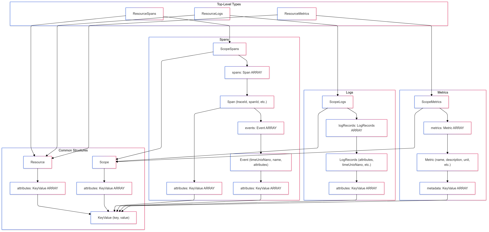

# Representing OTel Data

OpenTelemetry data is typically structured as nested JSON, which we can model into custom types in Feldera based on the [OTel Protobuf definitions](https://github.com/open-telemetry/opentelemetry-proto/tree/main/opentelemetry/proto). While it is possible to represent the entire OTel JSON data as a `VARIANT` type ([VARIANT docs](https://docs.feldera.com/sql/json#the-variant-type)), it is often more manageable to use custom types for easier querying.

```sql
CREATE TYPE KeyValue AS (
    key VARCHAR,
    value VARIANT
);

CREATE TYPE Event AS (
    timeUnixNano VARCHAR,
    name VARCHAR,
    attributes KeyValue ARRAY
);

CREATE TYPE Span AS (
    traceId VARCHAR,
    spanId VARCHAR,
    traceState VARCHAR,
    parentSpanId VARCHAR,
    flags BIGINT,
    name VARCHAR,
    kind INT,
    startTimeUnixNano VARCHAR,
    endTimeUnixNano VARCHAR,
    attributes KeyValue ARRAY,
    events Event ARRAY
);

CREATE TYPE Metric AS (
    name VARCHAR,
    description VARCHAR,
    unit VARCHAR,
    data VARIANT,
    metadata KeyValue ARRAY
);

CREATE TYPE LogRecords AS (
    attributes KeyValue ARRAY,
    timeUnixNano VARCHAR,
    observedTimeUnixNano VARCHAR,
    severityNumber INT,
    severityText VARCHAR,
    flags INT4,
    traceId VARCHAR,
    spanId VARCHAR,
    eventName VARCHAR,
    body VARIANT
);

CREATE TYPE Scope AS (
    name VARCHAR,
    version VARCHAR,
    attributes KeyValue ARRAY
);

CREATE TYPE ScopeSpans AS (
    scope Scope,
    spans Span ARRAY
);

CREATE TYPE ScopeLogs AS (
    scope Scope,
    logRecords LogRecords ARRAY
);

CREATE TYPE ScopeMetrics AS (
    scope Scope,
    metrics Metric ARRAY
);

CREATE TYPE Resource AS (
    attributes KeyValue ARRAY
);

CREATE TYPE ResourceMetrics AS (
    resource Resource,
    scopeMetrics ScopeMetrics ARRAY
);

CREATE TYPE ResourceSpans AS (
    resource Resource,
    scopeSpans ScopeSpans ARRAY
);

CREATE TYPE ResourceLogs AS (
    resource Resource,
    scopeLogs ScopeLogs ARRAY
);
```

The following graph illustrates the type hierarchy of the custom types defined above:



Now that we have the type definitions to represent the OTel data, we create tables.

```sql
-- Input table that ingests resource spans from the collector.
CREATE TABLE otel_traces (
    resourceSpans ResourceSpans ARRAY
) WITH ('append_only' = 'true');

-- Input table that ingests resource logs from the collector.
CREATE TABLE otel_logs (
    resourceLogs ResourceLogs ARRAY
) WITH ('append_only' = 'true');

-- Input table that ingests resource metrics from the collector.
CREATE TABLE otel_metrics (
    resourceMetrics ResourceMetrics ARRAY
) WITH ('append_only' = 'true');
```

Feldera operates on changes, so any input may be an insertion or deletion (Internally, Feldera represents these changes as [Z-sets](https://www.feldera.com/blog/database-computations-on-z-sets)). Setting `'append_only' = 'true'`, ensures only insertions are supported for this table.

