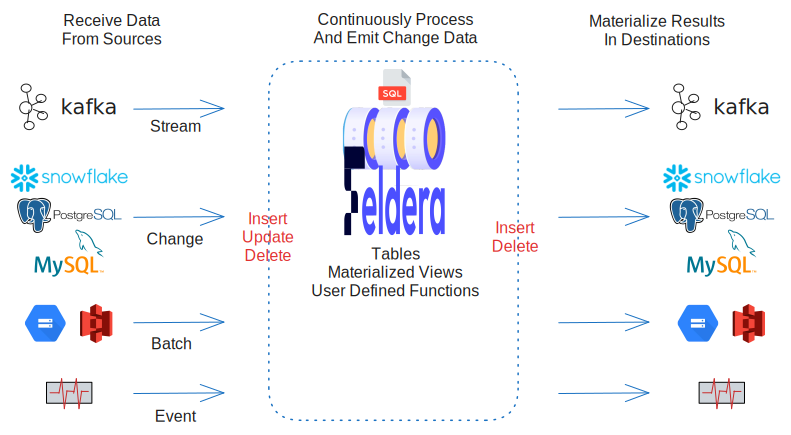

# What is Feldera?

Feldera **Continuous Analytics Platform**, also known as
**Feldera Platform**, is a set of containerized services packaging a fast
data computational engine for **continuous analytics**. Feldera Platform allows
users to run continuous queries directly on data in motion, without storing
the data in databases or storage systems, before querying.

With Feldera Platform, DML and DDL SQL written for popular databases can operate
continuously, with few changes, on data as it continuously arrives. This
site explains the concepts behind Feldera Platform and how to use it
through its user interface and API.

Feldera Platform's implementation is based on a streaming algebra called "DataBase
Stream Processor", [DBSP](https://www.feldera.com/vldb23.pdf).

## Concepts

Feldera Platform processes queries and produces output continuously.  When input
arrives, Feldera Platform recomputes query results and sends the changes to
outputs.  Feldera Platform queries are written in SQL, so users who have an
existing investment in analyzing data at rest with a SQL database can
use much the same code to analyze data continuously with Feldera Platform.

### Incremental processing

Feldera Platform is fundamentally **incremental** in how it handles input,
computation, and output.

For input, being incremental means that Feldera Platform processes data as it
arrives. Feldera Platform does not require all of the data to
be on hand before beginning computation. Unlike a database, Feldera Platform does
not durably store data.

For computation, being incremental means that when new data arrives,
Feldera Platform does a minimal amount of work to update query results, rather
than by fully recomputing them. This speeds up processing.

For output, being incremental means that Feldera Platform outputs query results as
sets of changes from previous output. This improves performance and
reduces output size.

### Programs

In Feldera Platform, a SQL **program** is a collection of SQL DDL (table
and view definitions):

* SQL table definitions with `CREATE TABLE` specify the format of
  data.  Feldera Platform does not store tables, since it is not a database, so
  table definitions do not reserve disk space or other storage.

* SQL view definitions with `CREATE VIEW` specify transformations and
  computations.  Views may draw data from tables and from other views.
  Feldera Platform provides powerful SQL analysis features, including time-series
  operators.

A program defines a computation, but it doesn't specify the source or
destination for data.  Those are the province of **connectors** and
**pipelines**, described below.

### Connectors

A **connector** gives Feldera Platform computation access to data.  There are
two classes of connectors: **input connectors** that connect a source
of input records to Feldera Platform table, and **output connectors** that
connect a DSBP view to a destination.

Feldera Platform includes input and output connectors for [Kafka], open source
event streaming software from the [Apache Software
Foundation][Apache].  Kafka's API is widely adopted, which means that
these connectors also allow Feldera Platform to work directly with [RedPanda] and
other software that use the same API.

Feldera Platform has a plug-in connector model.  This means that connectors can be
written to interface with whatever data sources and sinks a user would
find most convenient.

[Kafka]: https://kafka.apache.org/
[Apache]: https://www.apache.org/
[RedPanda]: https://redpanda.com/

### Pipelines

A user assembles a **pipeline** by attaching a program's tables to
input connectors and its views to output connectors. A Feldera Platform pipeline
is the top-level unit of execution. Once a Feldera Platform user assembles a
pipeline from a program and connectors, they may start, stop, manage,
and monitor it.

## Foundations

Feldera is the pioneering implementation of a new theory that unifies
databases, streaming computation, and incremental view maintenance,
written by the inventors of that theory. See our
[publications](/docs/papers) for all the details.

Feldera code is available on [Github][Feldera] using an MIT open-source
license. It consists of a Rust runtime and a SQL compiler.

[Feldera]: https://github.com/feldera/feldera
