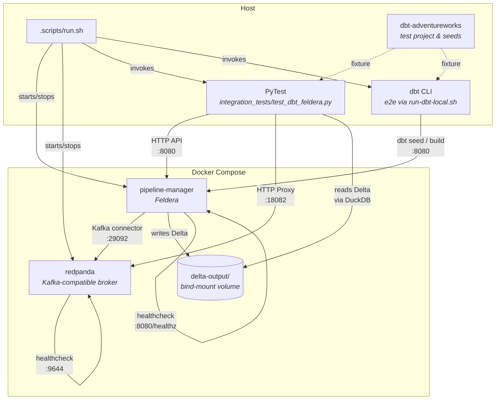

# Contributing to dbt-feldera

Thanks for your interest in contributing to **dbt-feldera**!
This guide covers the local development workflow, test infrastructure, and
conventions.

## Prerequisites

| Tool                                  | Version | Purpose                 |
| ------------------------------------- | ------- | ----------------------- |
| Python                                | 3.10+   | Runtime                 |
| [uv](https://github.com/astral-sh/uv) | latest  | Package & venv manager  |
| Docker (with Compose v2)              | latest  | Integration & e2e tests |

> Use the [vscode devcontainer](../../.devcontainer/devcontainer.json) to have a smoother onboarding experience!

## Quick start

```bash
cd python/dbt-feldera
.scripts/run.sh all        # venv → build → lint → unit → integration → e2e
```

## Development script

All development tasks go through a single entry-point — [`.scripts/run.sh`](.scripts/run.sh):

```bash
.scripts/run.sh <target>
```

| Target             | What it does                                              |
| ------------------ | --------------------------------------------------------- |
| `venv`             | Create a fresh virtual environment and install all deps   |
| `build`            | Build the wheel into `dist/*.whl`                         |
| `fix`              | Auto-fix lint issues (`ruff check --fix` + `ruff format`) |
| `lint`             | Check lint (`ruff check` + `ruff format --check`)         |
| `unit-test`        | Run `pytest tests/` (no Docker required)                  |
| `integration-test` | Start Feldera in Docker, run `pytest integration_tests/`  |
| `e2e`              | Full dbt CLI lifecycle against a Docker Feldera instance  |
| `all`              | Run every target above in sequence                        |

## Test architecture

### Overview

The integration tests spin up Feldera and Kafka via Docker Compose, and run a dbt project (`dbt-adventureworks`) against the live Feldera instance, and verify outputs including Delta Lake files.



### Test categories

| Category        | Directory                    | Docker? | What it validates                                                                         |
| --------------- | ---------------------------- | ------- | ----------------------------------------------------------------------------------------- |
| **Unit**        | `tests/unit/`                | No      | Adapter internals: credentials, columns, cursor, relations, SQL parsing, pipeline manager |
| **Integration** | `integration_tests/`         | Yes     | Full dbt ↔ Feldera round-trip: seed, run, test, incremental, Delta output, Kafka IVM      |
| **End-to-end**  | `integration_tests/scripts/` | Yes     | dbt CLI lifecycle (`debug → seed → build → docs generate`) against a real instance        |

### Integration test fixtures (conftest.py)

The PyTest session fixtures handle the Docker lifecycle automatically:

1. **`delta_output_dir`** — cleans and creates the `dbt-adventureworks/delta-output/` directory (bind-mounted into the Feldera container at `/data/delta`)
2. **`docker_feldera`** — starts Docker Compose, waits for health checks, yields the Feldera URL, and tears down on exit
3. **`kafka_proxy_url`** — resolves and waits for Redpanda's HTTP proxy
4. **`dbt_project_dir`** — returns the path to the `dbt-adventureworks` project

Set `FELDERA_SKIP_DOCKER=1` to skip Docker management and test against an
external Feldera instance.

### Docker Compose services

| Service            | Image                      | Ports                                 | Purpose                                     |
| ------------------ | -------------------------- | ------------------------------------- | ------------------------------------------- |
| `pipeline-manager` | `feldera/pipeline-manager` | `8080`                                | Feldera API + pipeline engine               |
| `redpanda`         | `redpanda:v23.1.13`        | `19092` (Kafka), `18082` (HTTP proxy) | Kafka-compatible broker for connector tests |

## Environment variables

| Variable              | Default                                              | Used by                   | Description                                                             |
| --------------------- | ---------------------------------------------------- | ------------------------- | ----------------------------------------------------------------------- |
| `FELDERA_URL`         | `http://localhost:8080`                              | `run.sh`, e2e             | Feldera API base URL                                                    |
| `FELDERA_SKIP_DOCKER` | _(unset)_                                            | `run.sh integration-test` | Set to `1` to skip Docker start/stop (use an external Feldera instance) |
| `FELDERA_IMAGE`       | `images.feldera.com/feldera/pipeline-manager:latest` | docker-compose            | Docker image for the Feldera container                                  |
| `FELDERA_PORT`        | `8080`                                               | docker-compose            | Host port mapped to the Feldera container                               |
| `RUST_LOG`            | `info`                                               | docker-compose            | Log level inside the Feldera container                                  |
| `SKIP_TEARDOWN`       | _(unset)_                                            | e2e (`run-dbt-local.sh`)  | Set to `1` to keep Feldera running after the e2e test and print UI URLs |
| `DBT_DOCS_PORT`       | `18081`                                              | e2e (`run-dbt-local.sh`)  | Host port for `dbt docs serve`                                          |

## Code style

We use [Ruff](https://docs.astral.sh/ruff/) for linting and formatting:

```bash
.scripts/run.sh lint       # check
.scripts/run.sh fix        # auto-fix
```