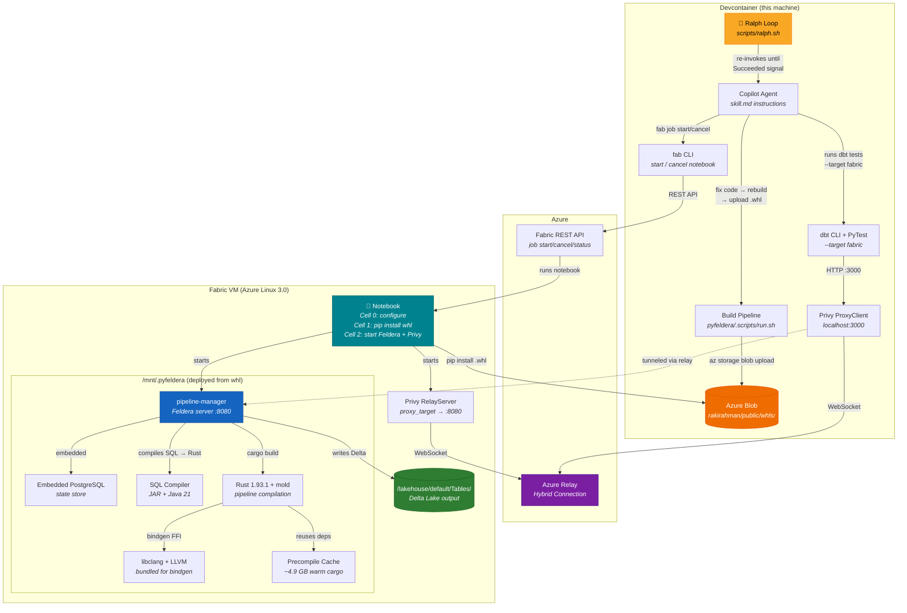

# Feldera on Microsoft Fabric

Run a full Feldera streaming SQL engine inside a Fabric notebook — no Docker, no Rust, no Java install required. Everything ships in a single `pip install`.

## Architecture




## Prerequisites

| Component             | Where         | Notes                               |
| --------------------- | ------------- | ----------------------------------- |
| Fabric notebook       | Fabric portal | Any Spark-attached notebook         |
| Azure Relay namespace | Azure portal  | For Privy browser proxy (optional)  |
| Fabric CLI (`fab`)    | Your laptop   | To start/stop the notebook remotely |

## Part 1 — Fabric notebook

### Cell 0 — Configure infra

```bash
%%configure
{
 "vCores": 2
}
```

### Cell 1 — Install

```python
%pip install --force-reinstall https://rakirahman.blob.core.windows.net/public/whls/pyfeldera-0.1.0-py3-none-any.whl
%pip install --force-reinstall https://rakirahman.blob.core.windows.net/public/whls/privy-0.0.1-py3-none-any.whl
%pip uninstall -y pathlib
```

> **Note:** Fabric ships a `pathlib` PyPI package that shadows the Python 3.12 stdlib. The uninstall is required.

### Cell 2 — Start Feldera + Privy proxy

```python
import threading, shutil, glob, requests
from pyfeldera.server import FelderaServer
from feldera import FelderaClient
from privy import RelayServer

# ── Config ──
RELAY_NS   = "..."
RELAY_PATH = "demo"
RELAY_RULE = "demo-listen-send"
RELAY_KEY  = "..."

# ── Clean lakehouse ──
for p in glob.glob("/lakehouse/default/Tables/*") + glob.glob("/lakehouse/default/Files/*"):
    shutil.rmtree(p, ignore_errors=True)

# ── Start Feldera (auto-deploys to /mnt if available for disk space) ──
server = FelderaServer(bind_address="127.0.0.1", port=8080)
threading.Thread(target=server.start_blocking, daemon=True).start()
server.wait_for_healthy(timeout=180)

# ── Verify ──
client = FelderaClient("http://127.0.0.1:8080")
cfg = client.get_config()
print(f" Feldera {cfg.version} ({cfg.edition})")
print(f" Pipelines: {requests.get('http://127.0.0.1:8080/v0/pipelines').json()}")

# ── Start Privy proxy (bridges your laptop browser → Feldera UI) ──
print(" Starting Privy Azure relay proxy...")
RelayServer(namespace=RELAY_NS, path=RELAY_PATH, keyrule=RELAY_RULE, key=RELAY_KEY, proxy_target="http://127.0.0.1:8080").serve_forever()
```

## Part 2 — This devcontainer

### Install tooling

```bash
sudo apt install -y pipx
sudo pipx ensurepath
sudo pipx install ms-fabric-cli
source ~/.bashrc

sudo mkdir -p ~/.config/fab
sudo chown -R $(id -u):$(id -g) ~/.config/fab

fab --version

# First-time auth
fab config set encryption_fallback_enabled true
fab auth login

# Privy — proxy Feldera UI to your browser
pip install https://rakirahman.blob.core.windows.net/public/whls/privy-0.0.1-py3-none-any.whl
```

### Fill up env file

Fill up `/workspaces/feldera/.vite/privy/.env`:

```text
STORAGE_KEY=...
PRIVY_RELAY_NAMESPACE=mdrrahman-dev-relay
PRIVY_RELAY_PATH=demo
PRIVY_RELAY_KEYRULE=demo-listen-send
PRIVY_RELAY_KEY=...
```

### Start the notebook remotely

```bash
# Navigate to your workspace
fab cd "SQL Telemetry & Intelligence - Insights - Dev - mdrrahman.workspace"

# List items (should show Feldera.Notebook)
fab ls "SQL Telemetry & Intelligence - Insights - Dev - mdrrahman.Workspace"

# Start the notebook (async — returns a job ID)
fab job start "SQL Telemetry & Intelligence - Insights - Dev - mdrrahman.Workspace/Feldera.Notebook"

# List all runs (find your job ID + status)
fab job run-list "SQL Telemetry & Intelligence - Insights - Dev - mdrrahman.Workspace/Feldera.Notebook"

# Check a specific run
fab job run-status "SQL Telemetry & Intelligence - Insights - Dev - mdrrahman.Workspace/Feldera.Notebook" --id <JOB_ID>
```

### Browse the Feldera Web UI

Once the notebook is running and Privy is serving, open http://localhost:3000:

```python
from privy import ProxyClientServer

ProxyClientServer(
    namespace="...",           # same Azure Relay namespace
    path="demo",
    keyrule="demo-listen-send",
    key="...",                 # same SAS key
    local_port=3000,
).serve_forever()
```

### Cancel the notebook

```bash
# Find the job ID from the run list
fab job run-list "SQL Telemetry & Intelligence - Insights - Dev - mdrrahman.Workspace/Feldera.Notebook"

# Cancel it
fab job run-cancel "SQL Telemetry & Intelligence - Insights - Dev - mdrrahman.Workspace/Feldera.Notebook" --id <JOB_ID>
```

### Run dbt against Fabric-hosted Feldera

With the Privy proxy running locally on port 3000:

```bash
cd python/dbt-feldera
.scripts/run.sh fabric-test
```

## Notes

- Fabric VMs have ~59 GB disk. The wheel + deploy uses ~20 GB. Cell 2 cleans duplicates to free ~9 GB.
- The `pathlib` PyPI package **must** be uninstalled — it breaks Python 3.12 stdlib imports.
- Privy uses Azure Relay hybrid connections — no inbound ports or public IPs needed.
- The Fabric CLI (`fab`) authenticates via your Microsoft Entra ID (device code flow).
